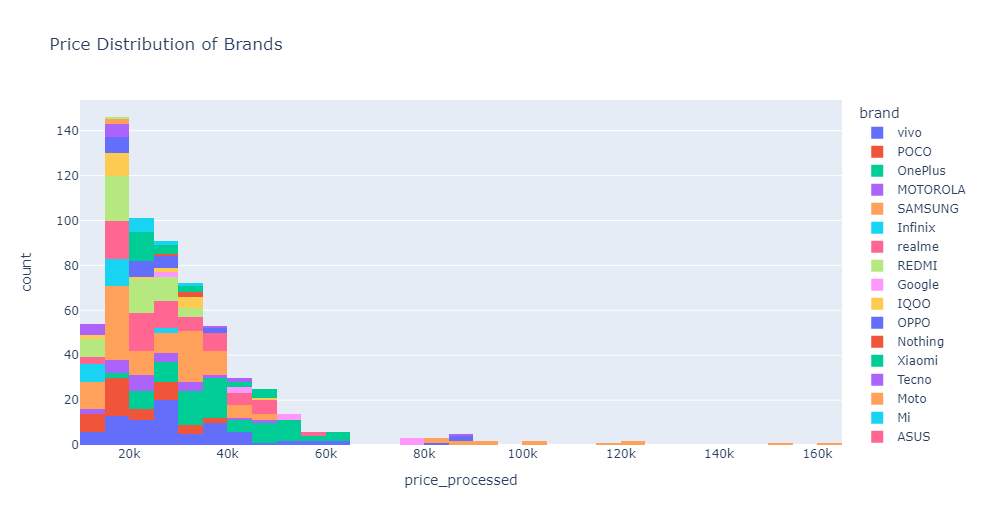

# Flipkart_Web_Scrape

Scrape 5g smartphone details from Flipkart

<div align="center">
  <a href="">
    
  </a>
</div>


## About The Project

Web scraping is an automatic method to obtain large amounts of data from websites. Most of this data is unstructured data in an HTML format which is then converted into structured data in a spreadsheet or a database so that it can be used in various applications.

In this project we scraped 30 pages from Flipkart related to 5g smartphones in 2023. And then we cleand the data and did some analysis on various features of the dataset.

### Dependencies

* BeautifulSoup
  
  ```python
  pip install bs4
  ```
  
* Plotly
  
  ```python
  pip install plotly
  ```


## Getting Started


### Using The Datasets


  * To use Raw Data scraped from Flipkart use the following dataset
    
    ```python
    df = pd.read_json("5gPhones.json")
    ```
    <div align="center">
      <a href="">
        
      </a>
    </div>


  * To use Cleaned Data read the following Dataset
    
    ```python
    df = pd.read_csv("5gPhones.csv") 
    ```
    <div align="center">
      <a href="">
        
      </a>
    </div>


### Refering The Notebooks


You can refer the notebooks that are uploaded in this repository to scrape and clean your own data from flipkart.

  * Refer `flipkart_5g_mobiles_scrape` For Scraping
  * Refer `5g Phones Data Cleaning.ipynb` For Cleaning the Data
  * Refer `flipkart 5g phones analysis.ipynb` For Analysis using Plotly


### Plotly For Data Vizualization


The plotly Python library is an interactive, open-source plotting library that supports over 40 unique chart types covering a wide range of statistical, financial, geographic, scientific, and 3-dimensional use-cases.

Built on top of the Plotly JavaScript library (plotly.js), plotly enables Python users to create beautiful interactive web-based visualizations that can be displayed in Jupyter notebooks, saved to standalone HTML files, or served as part of pure Python-built web applications using Dash. The plotly Python library is sometimes referred to as "plotly.py" to differentiate it from the JavaScript library.


Here are some examples of Data Vizualization using plotly : 


  * Availability of Different `ROM` Sizes in 5g phones :


    <div align="center">
      <a href="">
        
      </a>
    </div>


  * Distribution of `Price` w.r.t `Brands` :


    <div align="center">
      <a href="">
        
      </a>
    </div>


  * Availability of `Camera` at different `Price` Ranges :


    <div align="center">
      <a href="">
        
      </a>
    </div>


### PowerBi Dashboard


We have used PowerBi to design a DashBoard that you can use to visualize different features of the smartphones. You can also use the dashboard to filter out Brands and Models based on the selected Features.

Open `5g phone selection ui.pbix` in `PowerBi` to use the Dashboard.


## Acknowledgement


Here are some of the Documentations that you can refer for more information regarding different tools used in this project.


* [Plotting Graphs Using Plotly](https://plotly.com/python/)
* [Web Scraping with BeautifulSoup](https://www.geeksforgeeks.org/how-to-scrape-multiple-pages-of-a-website-using-python/)
* [Cleaning Data using Pandas and Numpy](https://www.w3schools.com/python/pandas/pandas_cleaning.asp)
* [Using Powerbi for Dashboard Presentation](https://powerbi.microsoft.com/en-au/business-analysts/)
